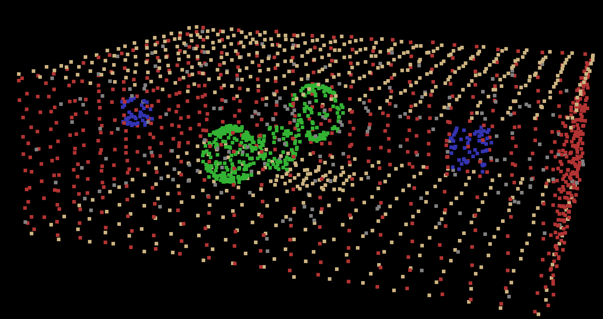

# 3D Point Cloud Room Generator

[](LICENSE)
[](https://www.python.org/downloads/release/python-3100/)
[](http://www.open3d.org/)
[](https://numpy.org/)

Generate synthetic 3D point cloud room environments with perfect semantic labels for computer vision, machine learning, and robotics applications.

## 🌟 Features

- Generate realistic indoor environments with various room parameters
- Create point clouds with perfect semantic labeling
- Control noise levels and point densities
- Export to industry-standard PLY format
- Visualize results with color-coded semantic classes
- No need for expensive LiDAR equipment or manual annotation
- Generate thousands of variations in minutes

## 📋 Overview

This repository provides a complete toolkit for generating synthetic 3D point cloud room data. It allows you to create perfectly labeled 3D environments without expensive scanning equipment or time-consuming manual annotation.

The generator creates rooms with:
- **Horizontal planes** (floors, ceilings, tables) - Label 1
- **Vertical planes** (walls) - Label 2
- **Spherical objects** - Label 3
- **Cubic objects** - Label 4
- **Ambient noise points** - Label 0

Example of a generated room with color-coded semantic labels:



## 🔧 Installation

### Prerequisites

- Python 3.10+
- Anaconda or Miniconda (recommended for environment management)

### Setup with Conda

```bash
# Clone the repository
git clone https://github.com/florentpoux/3d-room-generator.git
cd 3d-room-generator

# Create a conda environment
conda create -n room_generator python=3.10
conda activate room_generator

# Install dependencies
pip install -r requirements.txt
```

### Manual Setup

```bash
# Clone the repository
git clone https://github.com/florentpoux/3d-room-generator.git
cd 3d-room-generator

# Install dependencies
pip install numpy open3d matplotlib
```

## 🚀 Quick Start

Generate your first synthetic room in just a few lines of code:

```python
import numpy as np
from shape_generator import generate_room, write_ply_with_labels
from read_ply import visualize_point_cloud, generate_stats

# Generate a room with default parameters
points, labels = generate_room()

# Save to PLY file
write_ply_with_labels(points, labels, "my_first_room.ply")

# Visualize the result
visualize_point_cloud(points, labels)

# Generate statistics about the point cloud
generate_stats(labels)
```

## 📖 Documentation

Full documentation is available in the [docs](docs/) directory:

- [Getting Started Guide](docs/getting_started.md)
- [API Reference](docs/api_reference.md)
- [Examples and Tutorials](docs/examples.md)

### Core Functions

#### Generate Basic Shapes
```python
# Generate a horizontal plane (floor, ceiling, table)
points, labels = generate_horizontal_plane(
    center=[5, 5, 0],
    width=10,
    length=10,
    point_density=100,
    noise_level=0.02
)

# Generate a vertical plane (wall)
points, labels = generate_vertical_plane(
    center=[0, 5, 1.5],
    width=10,
    height=3,
    orientation=90,
    point_density=100,
    noise_level=0.02
)

# Generate a sphere
points, labels = generate_sphere(
    center=[5, 5, 1.5],
    radius=0.5,
    point_density=100,
    noise_level=0.02
)

# Generate a cube
points, labels = generate_cube(
    center=[3, 4, 1],
    size=0.8,
    point_density=100,
    noise_level=0.02
)
```

#### Generate Complete Rooms
```python
# Generate a single room
points, labels = generate_room(
    room_size=(10, 8, 3),
    num_spheres=2,
    num_cubes=3,
    base_point_density=50,
    noise_percentage=0.1,
    noise_level=0.02
)

# Generate multiple rooms
generate_room_scenes(
    num_scenes=5,
    output_dir="synthetic_rooms"
)
```

## 📊 Use Cases

1. **Training data for machine learning**
   - Create unlimited labeled examples for semantic segmentation networks

2. **Algorithm benchmarking**
   - Test point cloud processing algorithms against known ground truth

3. **Simulation environments**
   - Generate virtual environments for robotics or AR/VR applications

4. **Education**
   - Teach point cloud concepts with controllable examples

## 💡 Advanced Techniques

For advanced techniques and applications, including machine learning with synthetic point clouds, check out these resources:

- **[3D Data Science with Python Book](https://www.oreilly.com/library/view/3d-data-science/9781098161323/)** - Comprehensive guide to working with 3D data
- **[3D Geodata Academy](https://learngeodata.eu)** - Professional courses and advanced tutorials

The [3D Segmentor OS course](https://learngeodata.eu/3d-python-segmentation-course-os/) at the 3D Geodata Academy provides production-ready code for advanced synthetic data techniques, including:

- Advanced GAN-based refinement for ultra-realistic synthetic data
- Production-ready transfer learning pipelines
- Optimized implementations for professional use

## 📊 Examples

### Generate a Basic Room
```python
from shape_generator import generate_room, write_ply_with_labels

# Generate a basic room
points, labels = generate_room()

# Save to PLY file
write_ply_with_labels(points, labels, "basic_room.ply")
```

### Generate Multiple Room Variations
```python
from shape_generator import generate_room_scenes

# Generate 10 different rooms
generate_room_scenes(
    num_scenes=10,
    output_dir="my_synthetic_rooms"
)
```

### Visualize a Saved PLY File
```python
from read_ply import read_ply_with_labels, visualize_point_cloud

# Read PLY file
points, labels = read_ply_with_labels("path/to/room.ply")

# Visualize
visualize_point_cloud(points, labels)
```

## 🤝 Contributing

Contributions are welcome! Please feel free to submit a Pull Request.

1. Fork the repository
2. Create your feature branch (`git checkout -b feature/amazing-feature`)
3. Commit your changes (`git commit -m 'Add some amazing feature'`)
4. Push to the branch (`git push origin feature/amazing-feature`)
5. Open a Pull Request

## 📄 License

This project is licensed under the MIT License - see the [LICENSE](LICENSE) file for details.

## 🙏 Acknowledgments

- [Florent Poux]([https://learngeodata.eu](https://www.linkedin.com/in/florent-poux-point-cloud/)) - Project creator and maintainer
- [Open3D](http://www.open3d.org/) - 3D data processing library
- [NumPy](https://numpy.org/) - Scientific computing library

## 📞 Contact

Florent Poux - [@florentpoux](https://www.linkedin.com/in/florent-poux-point-cloud/) - howto@learngeodata.eu

Project Link: [https://github.com/florentpoux/3d-room-generator](https://github.com/florentpoux/3d-room-generator)

---

<p align="center">
  <a href="https://learngeodata.eu">
    3D Geodata Academy
  </a>
  <br>
  <em>© Florent Poux - LearnGeodata.eu</em>
</p>
